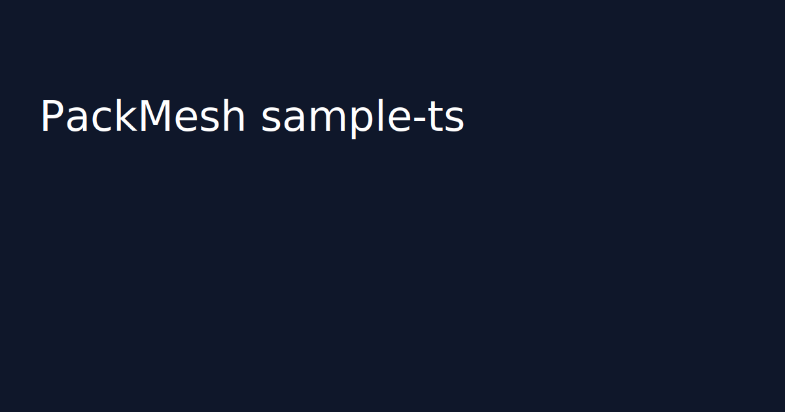
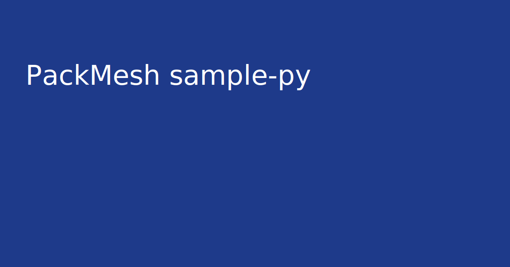
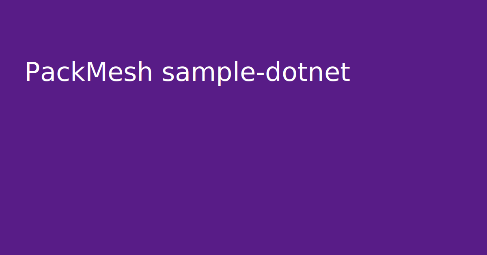
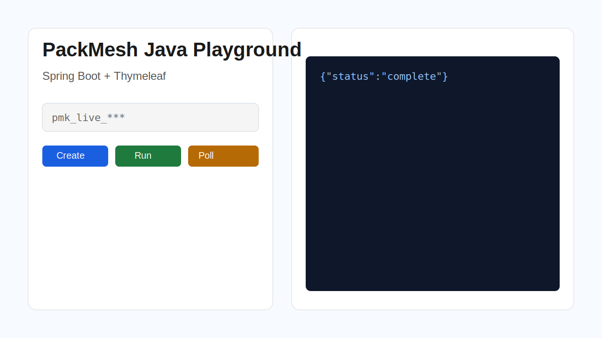
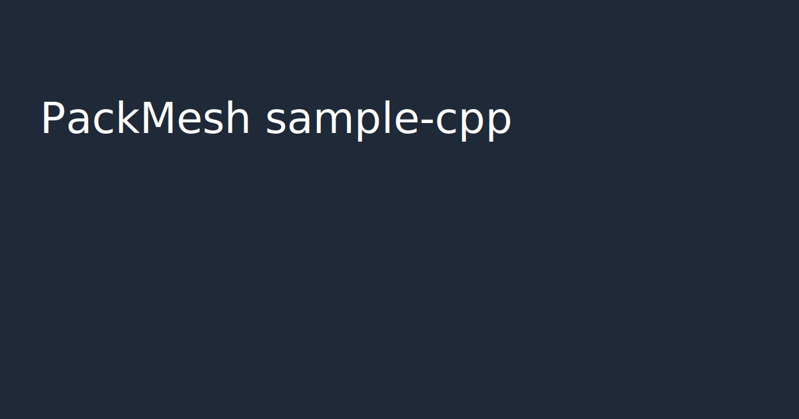

# packmesh-sample-apps: PackMesh Developer API sample apps

 

🚀 Create an account and run real scenarios at https://packmesh.com
PackMesh sample apps are **SEO-friendly**, production-inspired reference implementations for the PackMesh Developer API in **TypeScript (Next.js App Router)**, **Python (Streamlit)**, **C# (Blazor WebAssembly)**, **Java (Spring Boot + Thymeleaf)**, and **C++ (cpp-httplib)**.

Use this repository to:
- Learn PackMesh API request/response patterns quickly.
- Compare implementation choices across TypeScript, Python, C#, Java, and C++.
- Bootstrap your own integration with practical end-to-end playground flows.


## Why PackMesh sample apps are useful for businesses
- **Accelerate delivery:** teams can move from API exploration to pilot workflows faster using end-to-end examples instead of starting from scratch.
- **Reduce integration risk:** each sample demonstrates stable auth, run orchestration, polling, and error-handling patterns that are safe to adapt.
- **Show measurable value:** outputs map directly to business outcomes such as packaging cost reduction, better cube utilization, and improved shipment planning decisions.







## Quickstart (all apps)

```bash
# from this folder
npm install

# TypeScript / Next.js app
npm run dev -w apps/sample-ts

# Python / Streamlit app
cd apps/sample-py
python -m venv .venv
source .venv/bin/activate
pip install -r requirements.txt
streamlit run app.py

# C# / Blazor WASM app
cd ../../PackMesh-Api
./scripts/install-dotnet-sdk.sh 8.0
cd ../packmesh-sample-apps/apps/sample-dotnet
dotnet run

# Java / Spring Boot app
cd ../sample-java
./mvnw spring-boot:run
# Windows PowerShell: .\mvnw.cmd spring-boot:run

# C++ / cpp-httplib app
cd ../sample-cpp
cmake -S . -B build
cmake --build build
./build/sample-cpp

```

## Comparison

| App | Language | Framework | Quickstart | Live demo |
|---|---|---|---|---|
| sample-ts | TypeScript | Next.js App Router | `npm run dev -w apps/sample-ts` | GitHub Pages docs |
| sample-py | Python | Streamlit | `streamlit run app.py` | local |
| sample-dotnet | C# | Blazor WASM | `dotnet run` | local |
| sample-java | Java | Spring Boot + Thymeleaf | `mvn spring-boot:run` | local |
| sample-cpp | C++ | cpp-httplib | `cmake --build build && ./build/sample-cpp` | local |

## Features
- API key via env or in-app input with clear/reset.
- Scenario create + JSON editor, run, poll, retry/cancel controls.
- Results viewer (summary/raw/artifacts), downloadable JSON.
- Thin API clients with retry, timeout, request IDs, and consistent naming.
- Static SEO docs with OpenGraph/Twitter metadata.

## Common API use cases covered
- PackMesh API scenario creation examples.
- Run execution + status polling patterns.
- Results retrieval and artifact exploration workflows.
- Validation/error handling examples for playground-style tooling.

## Configuration
- TypeScript app: `NEXT_PUBLIC_PACKMESH_API_KEY`, `NEXT_PUBLIC_PACKMESH_BASE_URL`, `NEXT_PUBLIC_PACKMESH_TIMEOUT_MS`, `NEXT_PUBLIC_PACKMESH_POLL_INTERVAL_MS`.
- Python app: `PACKMESH_API_KEY`, `PACKMESH_BASE_URL`, `PACKMESH_TIMEOUT_MS`.
- C# app: `PACKMESH_API_KEY`, `PACKMESH_BASE_URL`.
- Java app: configure base URL in `WebController` and provide API key in the UI.
- C++ app: set `PACKMESH_BASE_URL` and run the local server binary.

## FAQ
- **Which base URL?** For current hosted API use `https://packmesh-api-prod-adhqddbbcnbadkhb.canadacentral-01.azurewebsites.net/api` (or override with `PACKMESH_BASE_URL`).
- **Where are secrets stored?** Locally only; never committed.

## Troubleshooting
- If `dotnet` is unavailable in this container, run `PackMesh-Api/scripts/install-dotnet-sdk.sh` first.

## GitHub SEO checklist
- Set repo name to `packmesh-sample-apps`.
- Set description with keywords: `PackMesh API sample apps in TypeScript, Python, C#, Java, and C++ (Next.js, Streamlit, Blazor, Spring Boot)`.
- Add topics: `packmesh`, `developer-api`, `nextjs`, `streamlit`, `blazor`, `spring-boot`, `cpp`, `typescript`, `python`, `csharp`, `java`, `monorepo`, `github-pages`.
- Enable Pages from GitHub Actions workflow.
